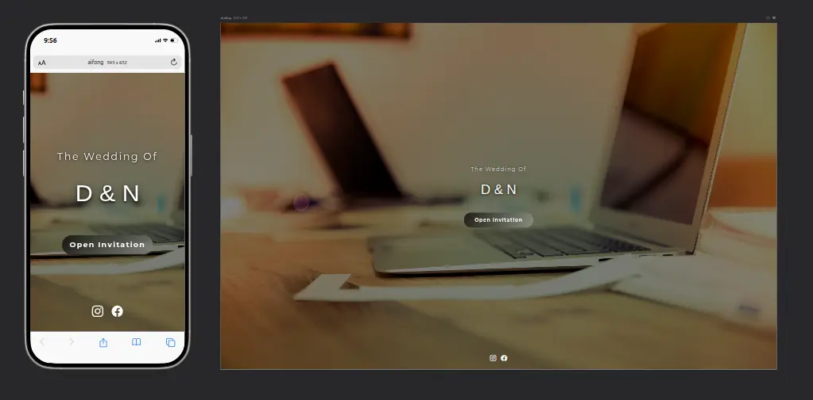
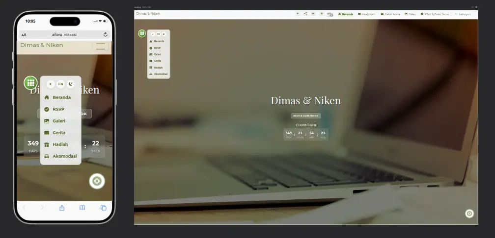
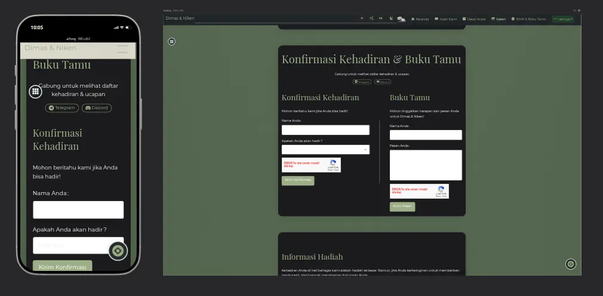

> **Note:** This version does not use Google reCAPTCHA or any captcha. All anti-spam and bot protection is handled by backend logic (honeypot, blacklist, time-based validation, rate limiting, and admin notification).

> **Security Notice:** If you discover any vulnerability in this project, please contact the author: jimbonluis90@gmail.com

# Simple Wedding Invitation

<p align="center">
  <a href="https://app.netlify.com/projects/invitation-dn/deploys">
    
  </a>
  <a href="https://github.com/jimbon25/simple-wedding-invitation/actions/workflows/ci.yml">
    
  </a>
  </a>
  <a href="LICENSE">
    
  </a>
  <a href="https://nodejs.org/">
    
  </a>
  <a href="https://github.com/jimbon25/simple-wedding-invitation/commits/main">
    
  </a>
  <a href="https://reactjs.org/">
    
  </a>
  <a href="#enhanced-visitor-tracking-system">
    
  </a>
  <a href="https://ai.google.dev/gemini-api">
    
  </a>
  <a href="#multi-platform-support">
    
  </a>
  <a href="https://core.telegram.org/bots/api">
    
  </a>
  <a href="https://discord.com/developers/docs/resources/webhook">
    
  </a>
  <a href="https://ipinfo.io/">
    
  </a>
</p>

<p align="center">


</p>
<p align="center">

</p>

This is a digital wedding invitation web app built with React and TypeScript. It provides a seamless, interactive experience for wedding guests with multi-language support, smooth animations, and robust security features. All anti-spam and bot protection is handled by backend logic (honeypot, blacklist, time-based validation, rate limiting, and admin notification)—no Google reCAPTCHA required. Features include personalized invitations, RSVP and guest book functionality, real-time notification integration with Discord and Telegram, advanced visitor analytics with suspect session, and a Gemini AI assistant for your guests.


## Table of Contents

- [Main Features](#main-features)
- [Stack](#stack)
- [Configuration](#configuration)
  - [Environment Variables](#environment-variables)
  - [Notification Systems](#notification-systems)
    - [Discord Webhook](#discord-webhook)
    - [Telegram Bot](#telegram-bot)
    - [Using Both Systems](#using-both-systems)
    - [Switching Between Systems](#switching-between-systems)
  - [Gemini AI Chat](#gemini-ai-chat)
  - [IP Geolocation Security](#ip-geolocation-security)
- [Deployment](#deployment)
  - [Netlify Deployment](#netlify-deployment)
  - [Vercel Deployment](#vercel-deployment)
  - [Self Hosted/Server Deployment](#self-hosted/server-deployment)
  - [Multi-platform Support](#multi-platform-support)
- [Security Measures](#security-measures)
  - [Rate Limiting](#rate-limiting)
- [Customization Guide](#customization-guide)
  - [Available Scripts](#available-scripts)
  - [Node.js Version](#nodejs-version)
- [Disclaimer](#disclaimer)
- [Terms of Service](#term-of-service)
- [Contact](#contact)
- [Acknowledgements](#acknowledgements)

## Main Features

- Personalized invitation with guest name and multi-language support
- Gallery with progressive image loading
- Gift info & registry
- Real-time notifications (Telegram & Discord)
- AI-powered Gemini Chat assistant
- Advanced backend security: IP geolocation, anti-bot/suspect detection, rate limiting

## Stack

### Frontend
- [React](https://reactjs.org/)
- [TypeScript](https://www.typescriptlang.org/)
- [Create React App](https://create-react-app.dev/)
- [React Router Dom 7](https://reactrouter.com/en/main)
- [Bootstrap](https://getbootstrap.com/)
- [Bootstrap Icons](https://icons.getbootstrap.com/)
- [AOS (Animate On Scroll)](https://michalsnik.github.io/aos/)
- [Slick Carousel](https://kenwheeler.github.io/slick/)

### Backend & Platform
- [Node.js](https://nodejs.org/)
- [Netlify Functions](https://docs.netlify.com/functions/overview/)
- [Vercel API Routes](https://vercel.com/docs/functions/serverless-functions)

### Security & Privacy
- [IPinfo.io](https://ipinfo.io/) (ASN detection)

### Notifications & Integration
- [Discord Webhooks](https://discord.com/developers/docs/resources/webhook) (RSVP, guest book)
- [Telegram Bot API](https://core.telegram.org/bots/api) (RSVP, guest book, suspect/bot alerts)

### AI assistant
- [Google Gemini API](https://ai.google.dev/gemini-api) (Q&A Feauture)

## Installation

1. Clone the repository:
   ```bash
   git clone https://github.com/jimbon25/simple-wedding-invitation.git
   cd simple-wedding-invitation
   ```

2. Install dependencies:
   ```bash
   npm install
   ```

3. Set up environment variables:
   - Copy `.env.local.example` to `.env.local`
   - Fill in your values (see Configuration section)

4. Start development server:
   ```bash
   npm start
   ```

5. Access the site at [http://localhost:3000](http://localhost:3000)

## Configuration

### Environment Variables

Set these environment variables on your hosting platform:

| Variable Name | Netlify | Vercel | Description |
|---------------|---------|--------|-------------|
| `SUSPECT_BOT_TOKEN` | ✓ | ✓ | Telegram bot token for suspect notification |
| `SUSPECT_CHAT_ID` | ✓ | ✓ | Chat ID to receive notifications for suspect |
| `DISCORD_WEBHOOK_URL` | ✓ | ✓ | Your Discord channel webhook URL |
| `TELEGRAM_BOT_TOKEN` | ✓ | ✓ | Your Telegram bot token |
| `TELEGRAM_CHAT_ID` | ✓ | ✓ | Chat ID to send notifications |
| `GEMINI_API_KEY` | ✓ | ✓ | Google Gemini API key |
| `GUEST_API_KEY` | ✓ | ✓ | Custom API key for guest |
| `PENTEST_RATE_KEY` | ✓ | ✓ | Custom API key for developers or pentest |
| `ANALYTICS_BOT_TOKEN` | ✓ | ✓ | Token for analytics Telegram bot |
| `ANALYTICS_CHAT_ID` | ✓ | ✓ | Chat ID for analytics data |
| `IPINFO_TOKEN` | ✓ | ✓ | Token for IP Geolocation services |
| `ALLOWED_COUNTRIES` | ✓ | ✓ | Comma-separated list of allowed country codes |
| `REACT_APP_GUEST_API_KEY` | ✓ | ✗ | Public guest API key (Netlify) |
| `REACT_APP_SITE_URL` | ✓ | ✗ | Site URL for Netlify |
| `NEXT_PUBLIC_GUEST_API_KEY` | ✗ | ✓ | Public guest API key (Vercel) |
| `NEXT_PUBLIC_SITE_URL` | ✗ | ✓ | Site URL for Vercel |
| `ADMIN_TELEGRAM_BOT_TOKEN` | ✓ | ✓ | Used for admin such as blacklist etc |
| `ADMIN_TELEGRAM_CHAT_ID` | ✓ | ✓ | Chat ID to receive notification |
| `DEV_MODE_SECRET` | ✓ | ✓ | Developer you can add if you want to skip track |

### Notification Systems

You can use Discord webhook, Telegram bot, or both for receiving notifications from RSVP and guest book submissions.

#### Discord Webhook

To use only Discord webhook for notifications:

1. Create a webhook in your Discord server:
   - Go to Server Settings > Integrations > Webhooks
   - Click "New Webhook", name it, and select a channel
   - Copy the Webhook URL

2. Add the webhook URL as environment variable:
   ```
   DISCORD_WEBHOOK_URL=your_webhook_url
   ```

3. To disable Telegram, simply don't set the `TELEGRAM_BOT_TOKEN` and `TELEGRAM_CHAT_ID` variables.

#### Telegram Bot

To use only Telegram bot for notifications:

1. Create a Telegram bot:
   - Message [@BotFather](https://t.me/botfather) on Telegram
   - Use `/newbot` command and follow the steps
   - Copy the bot token provided

2. Get your chat ID:
   - Add [@userinfobot](https://t.me/userinfobot) to your group
   - The bot will show you the chat ID

3. Add the Telegram variables:
   ```
   TELEGRAM_BOT_TOKEN=your_bot_token
   TELEGRAM_CHAT_ID=your_chat_id
   ```

4. To disable Discord, simply don't set the `DISCORD_WEBHOOK_URL` variable.

#### Using Both Systems

To receive notifications on both Discord and Telegram:

1. Configure both webhook URL and Telegram tokens as described above.
2. Set all related environment variables.
3. The system will automatically send notifications to both platforms.

#### Switching Between Systems

To switch from Discord to Telegram:

1. Add the Telegram environment variables as described above
2. Remove or comment out the Discord webhook URL
3. Redeploy your application

To switch from Telegram to Discord:

1. Add the Discord webhook URL as described above
2. Remove or comment out the Telegram variables
3. Redeploy your application

### Gemini AI Chat

1. Get a Gemini API key:
   - Visit [Google AI Studio](https://aistudio.google.com/app/apikey)
   - Create an API key

2. Set the environment variable:
   ```
   GEMINI_API_KEY=your_gemini_api_key
   ```

3. The AI chat is pre-configured to answer questions about your wedding invitation and will be available through a floating chat button.

**Customizing AI Responses:**
You can adjust the system prompt for Gemini AI to control the style, tone, and context of the chatbot's responses. By editing the system prompt in your backend or frontend integration, you can make the AI answer in a specific way (e.g., formal, friendly, informative, etc.) or focus on certain topics. This allows you to tailor the chatbot experience to match your event or audience needs.

For more information on configuring and using the Gemini API, see:
- [Gemini API Documentation](https://ai.google.dev/gemini-api/docs)
- [Gemini API Quickstart Guide](https://ai.google.dev/gemini-api/docs/get-started)

### IP Geolocation Security

1. Get an IP information API token:
   - Sign up at [ipinfo.io](https://ipinfo.io/)
   - Create an access token

2. Set environment variables:
   ```
   IPINFO_TOKEN=your_ipinfo_token
   ALLOWED_COUNTRIES=ID,SG,US,MY
   ```

3. The application will automatically check visitor IPs against:
   - Country code allowlist (e.g., only Indonesia, Singapore, etc.)
   - Suspicious ASN detection (blocks known VPN/proxy networks)
   - Anomaly detection for suspicious access patterns

## Deployment

The application supports deployment on both Netlify and Vercel platforms and automatically adapts to the hosting environment.

### Netlify Deployment

1. Connect your repository:
   - Go to [Netlify](https://www.netlify.com/)
   - Click "New site from Git"
   - Select your repository

2. Configure build settings:
   - Build command: `npm run build`
   - Publish directory: `build`

3. Set environment variables:
   - Go to Site settings > Build & deploy > Environment
   - Add all variables with `REACT_APP_` prefix for public variables

4. Deploy from terminal (alternative):
   ```bash
   npm run build
   netlify deploy --prod
   ```

### Vercel Deployment

1. Connect your repository:
   - Go to [Vercel](https://vercel.com/)
   - Click "Import Project"
   - Select your repository

2. Configure build settings:
   - Build command: `npm run build`
   - Output directory: `build`
   - Install command: `npm install`

3. Set environment variables:
   - Go to Project Settings > Environment Variables
   - Add all variables with `NEXT_PUBLIC_` prefix for public variables

4. Deploy from terminal (alternative):
   ```bash
   vercel --prod
   ```

### Self-Hosted/Server Deployment

You can deploy this app on your own VPS, cloud server, or shared hosting that supports Node.js and static file serving.

**Steps:**

1. **Build the app:**
   ```bash
   npm install
   npm run build
   ```

2. **Serve static files:**
   - Use a static file server like [serve](https://www.npmjs.com/package/serve), Nginx, Apache, or Caddy.
   - Example with `serve`:
     ```bash
     npx serve -s build
     ```
   - Or configure Nginx/Apache to point to the `build` directory.

3. **Set environment variables:**
   - For frontend-only deployments, set public variables in `.env.local` before building.
   - For backend/serverless features (RSVP, guest book, notifications), you need a Node.js backend or serverless platform. For custom backend, deploy the server code in `/api` or `/netlify/functions` using Express, Fastify, or similar.

4. **Custom backend/serverless:**
   - If you want to run backend endpoints yourself, move the logic from `/api` or `/netlify/functions` into an Express/Fastify app and run it on your server.
   - Example (Express):
     ```js
     const express = require('express');
     const app = express();
     // ...import and use your API logic...
     app.use(express.static('build'));
     app.listen(3000);
     ```

5. **Domain & SSL:**
   - Point your domain to your server and set up SSL (Let's Encrypt recommended).

**Notes:**
- For full backend features (notifications, analytics, security), you must run the backend/serverless code and set all required environment variables.
- For static-only deployments (no RSVP/guest book), you can just serve the `build` directory.
- Make sure your server supports Node.js 16.x, 18.x, or 20.x.

### Multi-platform Support

The application automatically detects whether it's running on Netlify or Vercel:

```typescript
// From src/utils/apiUtils.ts
export const getApiEndpoint = (endpoint: string): string => {
  // Detect if running on Vercel
  const isVercel = process.env.VERCEL === '1' || window.location.hostname.includes('vercel.app');
  
  // If on Vercel, use /api routes
  if (isVercel) {
    const endpointName = endpoint.replace('/.netlify/functions/', '');
    return `/api/${endpointName}`;
  }
  
  // If on Netlify or local development, use Netlify functions path
  return endpoint.startsWith('/.netlify') ? endpoint : `/.netlify/functions/${endpoint}`;
};
```

This ensures that API endpoints are correctly routed regardless of the hosting platform.

For more details:
- [Netlify Functions Documentation](https://docs.netlify.com/functions/overview/)
- [Vercel API Routes Documentation](https://vercel.com/docs/functions/serverless-functions)


## Security Measures

The application implements robust backend and frontend security measures:

- **Backend Rate Limiting:** Strict IP-based rate limiting (max 10 requests per 10 minutes per IP) is enforced on the backend. Developer/pentest with API key can bypass limits for testing.
- **Privacy:** For normal visitors, backend API responses are minimal and do not expose analytics or statistics.
- **Separate Analytics & Suspect Bots:** The system uses separate bots for analytics and suspect notifications. Normal guest activity is tracked by the analytics bot, while any suspicious or abnormal guest (VPN/proxy, non-Indonesia, bots, pentest attempts) is detected and reported by the suspect bot. This ensures that normal guests and suspect guests are clearly distinguished, and only suspicious activity triggers alerts to the suspect bot. The recorded data is strictly non-sensitive and public (such as browser, country, and visit time), never personal or private information. Alerts are only triggered by clear indicators of suspect activity, such as VPN/proxy usage, access from outside allowed countries, bot-like behavior, or pentest attempts.
- **Suspect/Bot Notification:** All blocked or suspicious access (VPN/proxy, non-ID or you can custom, bots, pentest attempts) triggers real-time notifications to Telegram and/or Discord. Use `SUSPECT_BOT_TOKEN` and `SUSPECT_CHAT_ID` for suspect/bot alerts.


## Customization Guide

The wedding invitation app is designed to be easily customized to fit your specific needs.

#### Images & Media

  **Replace Images**:
   - Wedding photos: Replace files in `/public/images/gallery/` (maintain filenames or update references)
   - Background images: Replace `/public/images/background.webp` and related images
   - Thumbnail weill generation automatic: Use `scripts/generate-thumbnails.js` to create optimized thumbnails

### Available Scripts & testing backend

- `npm start`: Run development server
- `npm test`: Run tests
- `npm run generate-thumbnails`: Automatic create thumbnails then `npm run build` for better production 
- `node --experimental-vm-modules ./node_modules/.bin/jest api/tests`: Test backend api vercel & `npm run test:backend`: Test backend netlify/unction both run on root folder

### Node.js Version

Recommended Node.js versions: **16.x**, **18.x**, or **20.x** [Node.js](https://nodejs.org/)

## Disclaimer

This project is provided as-is, without any warranty. Use at your own risk. The author is not responsible for any issues, damages, or losses resulting from the use, deployment, or modification of this code. Please review and test thoroughly before deploying to production.

## Terms of Service

By using this project, you agree to the following terms:

- This project is developed and maintained by me ([github.com/jimbon25](https://github.com/jimbon25)).
- The project uses several external APIs and services. You must comply with the terms of service of each provider:
  - [Google Gemini API](https://ai.google.dev/terms)
  - [IPinfo.io](https://ipinfo.io/developers/terms)
  - [Telegram Bot API](https://core.telegram.org/bots/api#terms)
  - [Discord Webhooks](https://discord.com/terms)

**Warning:** This project relies on third-party APIs. Usage of these APIs is subject to the respective provider's terms of service. You are responsible for ensuring compliance and for any consequences arising from misuse or violation of those terms.

## Contact

- Facebook: [Dimas LA](https://facebook.com/iv.dimas)


## Acknowledgements

Special thanks to the following libraries, services, and contributors that make this project possible:

- [React](https://reactjs.org/)
- [TypeScript](https://www.typescriptlang.org/)
- [Create React App](https://create-react-app.dev/)
- [Bootstrap](https://getbootstrap.com/)
- [AOS (Animate On Scroll)](https://michalsnik.github.io/aos/)
- [Slick Carousel](https://kenwheeler.github.io/slick/)
- [Google Gemini API](https://ai.google.dev/gemini-api)
- [IPinfo.io](https://ipinfo.io/)
- [Telegram Bot API](https://core.telegram.org/bots/api)
- [Discord Webhooks](https://discord.com/developers/docs/resources/webhook)


